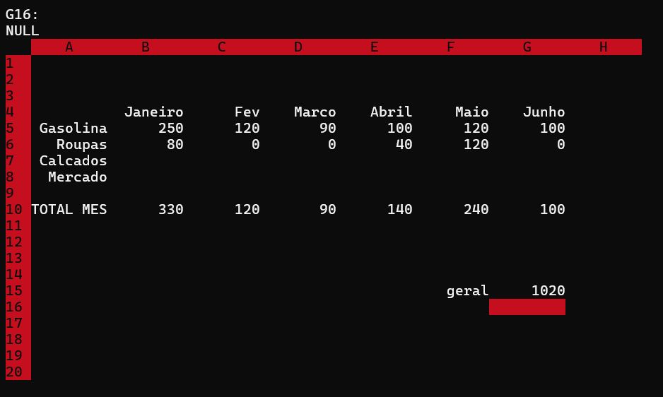

# Planilha-Eletrônica

Planilha Eletrônica desenvolvida em C

Projeto desenvolvido durante o quarto semestre da minha graduação em Sistemas de Informação.

Desenvolvido em C++, o projeto teve como objetivo explorar e fixar alguns conceitos importantes:

- **Matriz Esparsa**

- **Estrutura de dados dinâmica**: Foi utilizado Listas dinâmicas interligadas, assim como outras estruturas de dados.

- **Lista Dinâmica Generalizada**

- **Modularização do algoritmo**: Hoje, após alguns anos de estudo, consigo identificar inúmeros pontos do código que poderiam ser melhorados. Isso é algo natural com a experiência. No entanto, na época, desenvolver esse programa foi crucial para entender na prática a importância da modularização.

- **Biblioteca CONIO2**: Utilizei a biblioteca CONIO2 para o desenvolvimento visual do sistema. Foi muito interessante trabalhar pixel por pixel e desenvolver as telas para cada etapa do algoritmo.

---

### **Como rodar:**
1. Siga as instruções do repositório a seguir [Tutorial IDE](https://github.com/mateus-sm/Conio2-VsCode) para utilizar o VSCODE como IDE C / C++ (Copilar o arquivo). Tal repositório ja inclui a biblioteca do CONIO2 que é utilizada no projeto, caso opte por outra IDE de C / C++, certifique-se de incluí-la.
2. O arquivo `prono.dat` é a planilha que contém dados prontos, adicione no mesmo diretório para utilizar.
3. execute o programa `Excelgeral.cpp`.
4. A planilha que o usuário irá gerar se chamará `batman.dat`, e será salva no mesmo diretório do programa principal.

---

- **Funcionalidades implementadas**:

- Editar Célula: Ao pressionar a tecla F2 o conteúdo de uma célula poderá ser alterado, seja um valor, uma função ou uma
fórmula matemática.

- Salvar Planilha: Para salvar uma planilha deverá ser pressionada a tecla F3 e em seguida deverá ser fornecido o nome de
um arquivo. As células da planilha deverão ser salvas em um arquivo binário.

- Abrir Planilha: Para abrir uma planilha deverá ser pressionada a tecla F4 e deverá ser fornecido um nome de arquivo. O
arquivo binário será lido e então será construída a matriz esparsa. Logo em seguida, serão mostradas na tela as primeiras
linhas e colunas.

- Gerar Gráfico: A tecla F5 deverá ser usada para gerar um gráfico de barras. Para isso, deverá ser digitada a região da
planilha que servirá de origem de dados para gerar o gráfico.

- SUM: Retorna a soma de todos os números na lista de argumentos.
    Exemplos:
      Se a célula A2:E2 contiver 5, 15, 30, 40 e 50
      =SUM(A2:C2) é igual a 50

- AVG: Retorna a média aritmética dos elementos no intervalo.
    Exemplo:
      Se A1:A5 contiver os números 10, 7, 9, 27 e 2, então:
      =AVG(A1:A5) é igual a 11

- MAX: Retorna o maior valor dos elementos no intervalo.
    Exemplo:
      Se A1:A5 contiver os números 10, 7, 9, 27 e 2, então:
      =MAX(A1:A5) e igual a 27

- MIN: Retorna o menor valor dos elementos no intervalo.
    Exemplo:
      Se A1:A5 contiver os números 10, 7, 9, 27 e 2, então:
      =MIN(A1:A5) é igual a 2

- Resolver as equações matemáticas criadas pelo usuário:

    Exemplos de equações válidas:
    = B4 + C4 + D4 + E4 + F4
    = B4 + MAX (B4:F4)
    =MAX (B4:F4) / MIN (B4:F4) * 2 - 4
    =B4 * (10 - C4) - E4 / F4
    =B4*2+(E4*3)

    Obs: as equações matemáticas digitadas podem ou não ter espaço em branco entre valores/funções/coordenadas e operadores.

- As equações deverão ser resolvidas usando uma lista generalizada. Seu algoritmo deverá construir uma lista generalizada 
segundo as prioridades e resolver a expressão “podando” os nodos da lista generalizada até sobrar um único nodo com o 
resultado, cujo valor deverá ser retornado. A medida que cada operação vai sendo resolvida, os nodos da lista generalizada 
devem ser removidos e sobrar apenas um nodo com o resultado. O nó da lista deverá ser construído com o uso de union, uma 
vez que o nodo poderá ser um valor (float), um operador (char) ou uma função (SUM(??:??), AVG(??:??), MIN(??:??) E 
MAX(??:??)). 
Tipos de nodos:

---

- **Imagens do Programa**:

